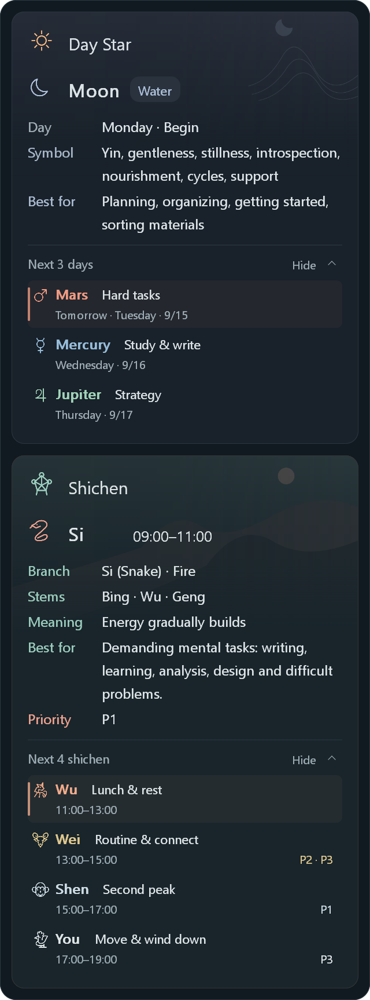

<div align="center">


# Astral Rhythm

**Give your week a direction. Give your day a rhythm.**  
七曜工作法 · Work in rhythm.

[](https://github.com/Lcub3d/Astral-Rhythm/releases/latest)
[](https://github.com/Lcub3d/Astral-Rhythm/actions/workflows/windows.yml)


[简体中文](README.md) · **English**

**[Download for Windows](https://github.com/Lcub3d/Astral-Rhythm/releases/latest)** · [The interface](#a-glance-not-another-dashboard) · [The inspiration](#old-ideas-a-modern-working-rhythm) · [Make it yours](#make-it-yours)

</div>

---

Some tools tell you how many tasks are left. **Astral Rhythm asks what deserves your attention now.**

A quiet Windows taskbar companion, it combines seven day stars with twelve traditional two-hour periods, called *shichen*. Use a weekly theme to orient yourself, then a smaller prompt to return to the present. Planning, focused work, collaboration, maintenance and rest all have a place.

Not every minute needs filling. Sometimes it needs a little direction.

## A glance, not another dashboard

<table>
<tr><th>Dark · 简体中文</th><th>Light · English</th></tr>
<tr>
<td align="center" valign="top"></td>
<td align="center" valign="top"></td>
</tr>
</table>

Two transparent taskbar rows; two independent hover cards. **Day Star above, Shichen below.** Each has its own identity and background. Traditional symbolism stays separate from the other section, with room for practical, editable guidance.

These images are exported by the **application's native Windows renderer**, with real font measurements and a fixed example time. The cover adds a promotional background around those exports. They are neither AI concept art nor recordings of taskbar interaction. See [how the images are made](docs/VISUALS.md).

| Lightweight | Distinct | Yours |
| :--- | :--- | :--- |
| Native Go + Win32 | Independent day and hour cards | English, Chinese or system language |
| Offline, no account required | Light and dark themes | Edit guidance in Excel |
| A hover away from your work | Five-element text accents | Drag to position; adjust font size |

## Look ahead only when you choose

**New in v1.1:** two independent, initially collapsed drawers — **Next 3 days** and **Next 4 shichen**. They remain inside the existing cards; reopening the popup always returns to the present.



Names, five-element colors, dates/times and short work labels make the next steps scannable. The nearest item has a subtle accent line, and periods crossing midnight are marked explicitly. Click a row for its complete source guidance; click again to collapse it. Browsing never changes the current card identities or taskbar labels.

An opened drawer stays readable when the pointer leaves. Click the taskbar companion to close the popup; all preview expansion resets on the next visit. Long content scrolls. Existing detail preferences remain separate.

Labels summarize the supplied guidance: **Wu means lunch and rest**, and **Yin means continuing sleep**, not starting work. Priorities appear only where supplied. Edited workbook cells never inherit stale summaries; a current-text excerpt replaces the default label. See [preview behavior and data rules](docs/PREVIEW.md).

## Old ideas, a modern working rhythm

> **观乎天文，以察时变。**  
> *Observe the patterns of the heavens to discern changes in time.*  
> — *Zhouyi*, Bi, Commentary on the Judgment [¹](https://zh.wikisource.org/wiki/周易/賁)

We borrow an attitude, not a prediction: notice the pattern before choosing the action. A clock can mark more than passing minutes; it can become a small cue to reconsider where your effort belongs.

> **一日一易，七日周而复始。**  
> *One changes each day; after seven days, the cycle begins again.*  
> — *Xiuyao jing*, lower scroll, chapter on the seven-day cycle [²](https://tripitaka.cbeta.org/T21n1299_002)

This passage describes the sun, moon and five planets in a seven-day sequence, with names from different regions. It is one historical reference for the software's imagery. The working themes below are a **modern arrangement from the project's guidance tables**, not a translation of ancient productivity instructions.

| Day | Day star | Theme | Built-in modern focus |
| :--- | :--- | :--- | :--- |
| Monday | Moon | Plan | Planning, organizing, starting, reviewing materials |
| Tuesday | Mars | Tackle | Hardest tasks, execution, challenges, exercise |
| Wednesday | Mercury | Think | Writing, learning, research, communication |
| Thursday | Jupiter | Grow | Strategy, cooperation, decisions, coordination |
| Friday | Venus | Connect | Presentations, relationships, creativity, wrap-up |
| Saturday | Saturn | Restore | Housework, organizing, repairs, long-term affairs |
| Sunday | Sun | Renew | Rest, outdoors, family, reflection, light planning |

> **君子藏器于身，待时而动。**  
> *Keep your capabilities ready, and act when the time is right.*  
> — *Zhouyi*, Appended Statements, Part II [³](https://zh.wikisource.org/wiki/周易/繫辭下)

Our interpretation: preparation and recovery belong beside action. The shichen card offers a smaller-scale cue for the next part of your day. **Tradition supplies imagery; you make the decisions.** Quotations express cultural inspiration, not evidence of productivity or health benefits. Adjust the guidance to your actual responsibilities, energy and deadlines. English renderings above are the project's own translations; see [sources and boundaries](docs/TRADITION.md).

## Nineteen identities, one coherent design


Celestial line art for day stars; zodiac line art for shichen. The upper card changes with the weekday, the lower with the two-hour period. Each taskbar line uses its own element color. Sun-as-fire and Moon-as-water are interface conventions in this project.

## Get started

Download **`Astral-Rhythm_v1.0.0_Windows_x64.zip`** from [Releases](https://github.com/Lcub3d/Astral-Rhythm/releases/latest). Close any older instance, extract the whole folder and run **`AstralRhythm.exe`**. The portable app needs no Go, Python, .NET or WebView installation.

| Gesture | Action |
| :--- | :--- |
| Hover | Show the current cards |
| Click | Pin or dismiss |
| Hold the left button and drag | Reposition and remember the placement |
| Right-click | Language, theme, font size, startup and other settings |
| `Start-English.cmd` / `Start-Chinese.cmd` | Launch in a chosen language |
| `Reset-Position.cmd` | Recover an offscreen or misplaced companion |

Startup is opt-in. The companion is a taskbar-adjacent window, not a native reserved tray slot: drag it into a free space when needed. **Code → Download ZIP** downloads source, not a ready-to-run application.

## Make it yours

The two workbooks in **`表格`** contain the guidance. Save your changes and the app reloads them after about five seconds. Keep filenames, headers and day/hour identifiers intact. Blank priority values remain blank; invalid edits do not replace the last valid data.

English translations live in **`locales/en.json`** and match the exact Chinese source text. A changed cell without a matching translation remains in its original language rather than silently showing a stale translation. No online translation service is used.

When upgrading, copy your customized workbooks into the new package. Settings remain in **`%APPDATA%\Astral`** for compatibility with early test builds.

<details>
<summary><strong>Build, verification and project structure</strong></summary>

The source is in `src/`. Go 1.23 or newer; no third-party Go dependencies.

```powershell
cd src
go test -v ./...
$env:GOOS = 'windows'
$env:GOARCH = 'amd64'
$env:CGO_ENABLED = '0'
go build -trimpath -ldflags="-H=windowsgui -s -w" -o ../AstralRhythm.exe .
```

After changing the version, run `python tools/build_resources.py` from the repository root before building. Windows CI exports the native interface via `TestNativeDocumentationRenders`; `tools/build_docs.py` composes the README artwork. Fonts come from the build machine and are never distributed.

Tests cover data consistency, time boundaries, language handling, section separation, transparent pixels and layouts. Estimated layout checks are not desktop tests. Native offscreen renders also do not establish interactive compatibility with every taskbar configuration.

`src/` application and tests · `tools/` build and packaging · `docs/` imagery and references · `locales/` translations · `表格/` editable guidance.

Public releases begin at **v1.0.0**. Earlier numbers identified development builds. The settings field `ui_version` is a migration schema, not a product release number.

</details>

---

<div align="center">

**Less hurry. More rhythm.**  
Astral Rhythm · 七曜工作法

[Report an issue](https://github.com/Lcub3d/Astral-Rhythm/issues) · [Changelog](CHANGELOG.md) · [简体中文](README.md)

</div>
