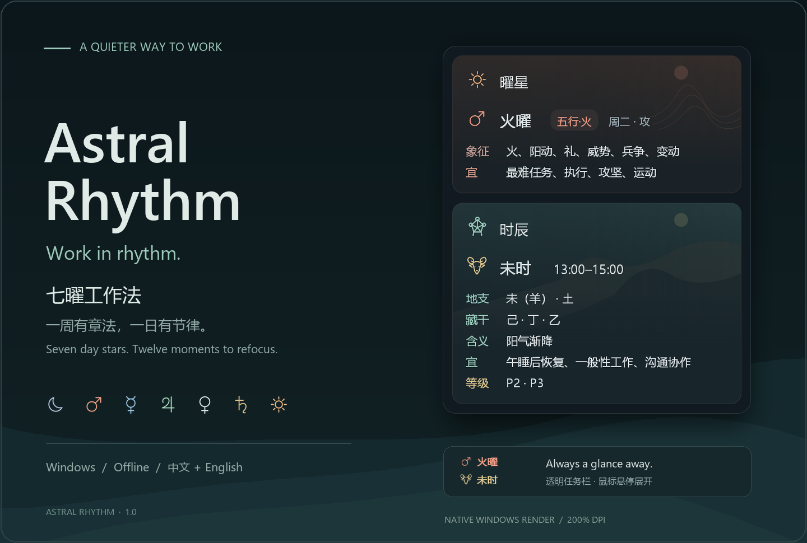
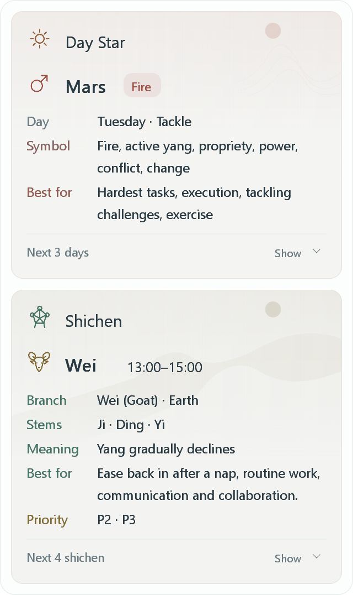
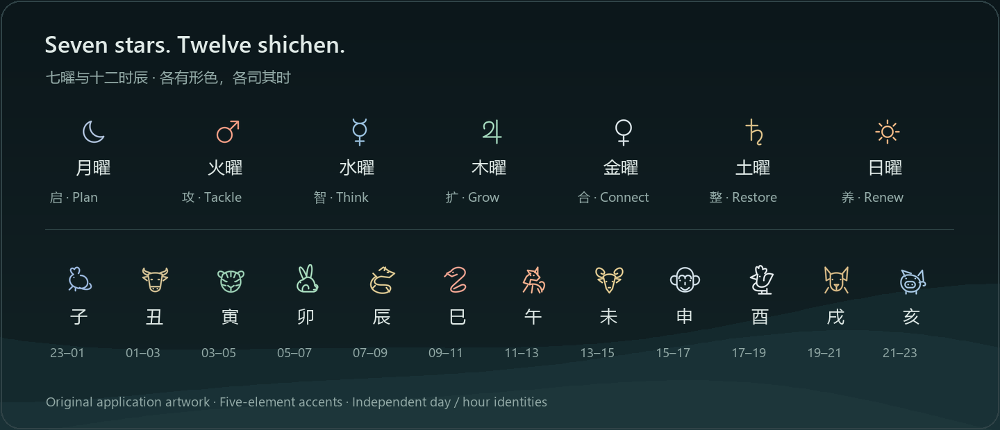

<div align="center">



# Astral Rhythm · 七曜工作法

**一周有章法，一日有节律。**  
Work in rhythm.

[](https://github.com/Lcub3d/Astral-Rhythm/releases/latest)
[](https://github.com/Lcub3d/Astral-Rhythm/actions/workflows/windows.yml)


**简体中文** · [English](README.en.md)

**[下载 Windows 版](https://github.com/Lcub3d/Astral-Rhythm/releases/latest)** · [看看界面](#一眼看见当下) · [传统与灵感](#古人的时间感今天的工作法) · [自定义建议](#让它适合你的工作)

</div>

---

有些工具提醒你：还剩多少任务。  
**Astral Rhythm 想提醒你：此刻，什么更值得做。**

它安静地待在 Windows 任务栏旁，用**七曜**给一周一个方向，用**十二时辰**给当下一个提示。把规划、攻坚、思考、协作、整理与休息，放回各有轻重的节奏里。

不是把每一分钟填满，而是让每一段时间各得其所。

## 一眼看见当下

<table>
<tr><th>深色 · 简体中文</th><th>浅色 · English</th></tr>
<tr>
<td align="center" valign="top"></td>
<td align="center" valign="top"></td>
</tr>
</table>

**任务栏只留两行图标和文字。** 没有可见底板，没有常驻大面板；需要时，悬停展开山岚双卡。上卡讲今天，下卡讲此刻。曜星与时辰各有图标、底纹与五行色，不把两套解释混在一起。

上图由 **Windows 上的程序原生绘制代码**导出，使用固定示例时间与实际字体度量；首页封面将这些界面图与品牌背景合成。它们不是 AI 概念图，也不冒充桌面交互录像。可复现过程见 [图像说明](docs/VISUALS.md)。

| 轻一点 | 清楚一点 | 自由一点 |
| :--- | :--- | :--- |
| 原生 Go + Win32，解压即用 | 曜星在上，时辰在下 | 中文、English、跟随系统 |
| 离线运行，无须账号 | 深浅主题，独立分区 | Excel 编辑自己的工作建议 |
| 悬停查看，不抢主工作区 | 木青、火赤、土黄、金白、水蓝 | 拖动定位，字号可调 |

## 想看未来时，再展开

**v1.1 新增：未来 3 日 / 后续时辰。** 两组预览都在原来的卡片里，默认收起、独立开关；关闭悬浮卡后，下次仍然只看当下。


点上卡的 **未来 3 日**，看后面三天的曜星、日期和工作关键词；点下卡的 **后续时辰**，看接下来四个时辰的名称、时段和关键词。五行色仅作辅助，名称和文字始终保留，最近一项用细色线标记。跨午夜明确标出“明日／次日”。

预览行还可以点开，查看来自原表的完整适宜事项，再点一次收起。查看未来不会替换“今天／此刻”，也不会改变任务栏显示。展开后移开鼠标不会立刻消失，可点击任务栏按钮关闭；关闭后预览状态不保存。内容过长时滚轮查看。

短标签来自原始建议的摘要，而不是新的规则：例如 **午时＝午餐休息**、**寅时＝继续睡眠**。P1/P2/P3 仅在原表填写时显示。修改 Excel 后不会继续套用旧的摘要；会显示新内容的首段，点击可读完整内容。详见 [预览交互与数据规则](docs/PREVIEW.md)。

## 古人的时间感，今天的工作法

### 观时：先看节律，再安排事情

> **观乎天文，以察时变。**  
> ——《周易·贲·彖传》[¹](https://zh.wikisource.org/wiki/周易/賁)

我们从这句话借来一种看待时间的方式：时间不仅是流逝的数字，也可以是观察变化、调整行动的线索。软件将这一意象化为一个小小的提醒：先抬头看看今天，再决定眼下把注意力放在哪里。

### 周而复始：让一周有自己的秩序

> **一日一易，七日周而复始。**  
> ——《宿曜经》卷下·七曜直日历品第八[²](https://tripitaka.cbeta.org/T21n1299_002)

《宿曜经》在这一段记述了日月五星的七日轮转，并列出不同地域的称呼。这是软件“七曜”意象的一处历史出处。**“启、攻、智、扩、合、整、养”是本项目的现代工作编排，不是典籍原文。**

| 星期 | 七曜 | 一字节奏 | 内置的现代工作方向 |
| :--- | :--- | :---: | :--- |
| 周一 | 月曜 · 太阴 | **启** | 规划、整理、启动、梳理资料 |
| 周二 | 火曜 · 荧惑 | **攻** | 最难任务、执行、攻坚、运动 |
| 周三 | 水曜 · 辰星 | **智** | 写作、论文、学习、研究、沟通 |
| 周四 | 木曜 · 岁星 | **扩** | 战略、合作、重要决策、资源协调 |
| 周五 | 金曜 · 太白 | **合** | 汇报、展示、关系维护、创意、总结 |
| 周六 | 土曜 · 镇星 | **整** | 家务、整理、维修、长期事务 |
| 周日 | 日曜 · 太阳 | **养** | 休息、户外、家庭、复盘、轻规划 |

### 待时而动：把力气用在合适的地方

> **君子藏器于身，待时而动。**  
> ——《周易·系辞下》[³](https://zh.wikisource.org/wiki/周易/繫辭下)

对这款工具而言，“待时”不是等待好运，而是提醒自己在推进之外留出准备、整理与恢复的空间。时辰卡以子、丑、寅、卯等十二地支标记两小时一段的日常时间，帮助你从“今天要做什么”落到“现在先做什么”。

**传统提供意象，安排由你决定。** 典籍引文用于说明文化灵感，不是效率或健康效果的证明；内置建议来自项目表格，可根据真实作息、职责和截止日期修改。典籍、传统象征与现代建议的边界见 [出处与设计解读](docs/TRADITION.md)。

## 每一曜、每一时，都有自己的样子



七曜采用星象线稿，时辰采用地支生肖线稿；配色克制，文字清楚。**上卡随曜日切换，下卡随时辰切换。** 任务栏两行文字分别按自身五行着色；日曜用火色、月曜用水色是本项目的界面约定。

## 开始使用

从 [Releases](https://github.com/Lcub3d/Astral-Rhythm/releases/latest) 下载 **`Astral-Rhythm_v1.0.0_Windows_x64.zip`**。先退出旧程序，完整解压，再双击 **`AstralRhythm.exe`**。成品不需要安装 Go、Python、.NET 或 WebView。

| 操作 | 结果 |
| :--- | :--- |
| 鼠标悬停 | 展开当前曜星与时辰卡片 |
| 单击控件 | 固定或收起卡片 |
| 按住左键拖动 | 调整任务栏位置，并记住位置 |
| 右键 | 语言、主题、字号、开机启动等设置 |
| `Start-English.cmd` / `Start-Chinese.cmd` | 直接以指定语言启动 |
| `Reset-Position.cmd` / `恢复默认位置.cmd` | 控件找不到时恢复位置 |

开机启动默认关闭。软件是贴附任务栏的独立小窗，不会替 Windows 系统托盘自动腾出空间；首次运行可拖到空位。`Code → Download ZIP` 是源码，不是成品程序。

## 让它适合你的工作

建议保存在 **`表格`** 文件夹的两份 Excel 中，保存后约 5 秒重新读取。请保留文件名、表头及星期／时辰标识。原表空白的工作等级不会擅自补填；无效修改不会覆盖上一次有效数据。

英文翻译在 **`locales/en.json`**，按中文原文精确匹配。新增内容尚无译文时显示原文，不会套用已经不相符的旧翻译。软件不联网翻译，也不修改你的原始表格。

升级时，将自己改过的“表格”文件夹复制到新版；设置继续保存在 **`%APPDATA%\Astral`**，保留早期试用版本的位置和界面偏好。

<details>
<summary><strong>构建、验证与项目结构</strong></summary>

源码位于 `src/`，Go 1.23 或更新版本，无第三方 Go 依赖。

```powershell
cd src
go test -v ./...
$env:GOOS = 'windows'
$env:GOARCH = 'amd64'
$env:CGO_ENABLED = '0'
go build -trimpath -ldflags="-H=windowsgui -s -w" -o ../AstralRhythm.exe .
```

修改版本后，先在仓库根目录运行 `python tools/build_resources.py`，更新 Windows 图标、版本与 DPI 资源。原生界面图由 Windows CI 的 `TestNativeDocumentationRenders` 导出，随后 `tools/build_docs.py` 合成文档图片。字体取自构建机系统，不随软件分发。

CI 包含数据一致性、时辰边界、语言、分区、透明像素与布局测试，并在 Windows 环境编译。估算布局检查不等同桌面测试；原生界面导出也不证明所有 Windows 任务栏配置的交互兼容性。

`src/` 程序与测试 · `tools/` 构建与打包 · `docs/` 图像与典籍出处 · `locales/` 翻译 · `表格/` 可编辑建议。

公开版本从 **v1.0.0** 开始。此前编号只用于开发试用；设置中的 `ui_version` 是迁移格式，不是产品发行版本。

</details>

---

<div align="center">

**不必时时用力，但愿事事有节。**  
Astral Rhythm · Work in rhythm.

[反馈问题](https://github.com/Lcub3d/Astral-Rhythm/issues) · [更新记录](CHANGELOG.md) · [English](README.en.md)

</div>
